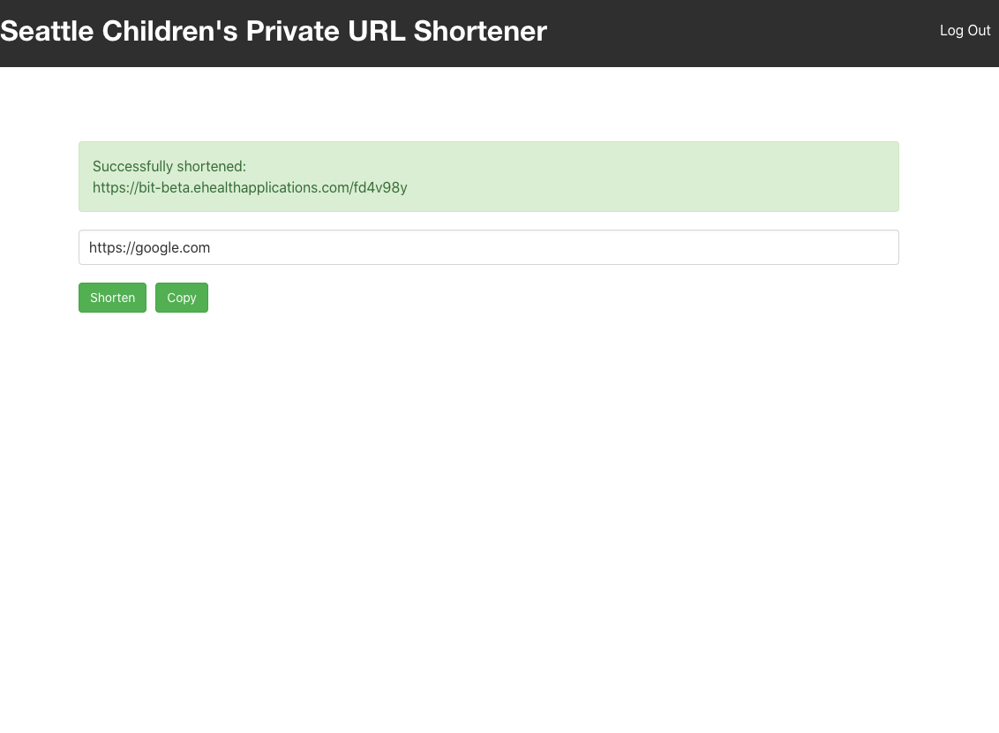

<!-- # Copyright 2019 Amazon.com, Inc. or its affiliates. All Rights Reserved.
# SPDX-License-Identifier: MIT-0
# 
# Permission is hereby granted, free of charge, to any person obtaining a copy of this
# software and associated documentation files (the "Software"), to deal in the Software
# without restriction, including without limitation the rights to use, copy, modify,
# merge, publish, distribute, sublicense, and/or sell copies of the Software, and to
# permit persons to whom the Software is furnished to do so.
# 
# THE SOFTWARE IS PROVIDED "AS IS", WITHOUT WARRANTY OF ANY KIND, EXPRESS OR IMPLIED,
# INCLUDING BUT NOT LIMITED TO THE WARRANTIES OF MERCHANTABILITY, FITNESS FOR A
# PARTICULAR PURPOSE AND NONINFRINGEMENT. IN NO EVENT SHALL THE AUTHORS OR COPYRIGHT
# HOLDERS BE LIABLE FOR ANY CLAIM, DAMAGES OR OTHER LIABILITY, WHETHER IN AN ACTION
# OF CONTRACT, TORT OR OTHERWISE, ARISING FROM, OUT OF OR IN CONNECTION WITH THE
# SOFTWARE OR THE USE OR OTHER DEALINGS IN THE SOFTWARE. -->

# URL Shortener Client
This application is a simple Vuejs application that interacts with the functionless url shortener.



## Requirements
* [Node](https://nodejs.org)

## Setup

**In order for the local client to work for testing, be sure and set the *UseLocalClient* option when launching the backend stack**

**The following commands need to be run from within the `client` folder.**

### 1. Update the environment variables in the `.env` file.
The client needs some information about the backend. These values were output when you deployed the backend. If you need them again, simply run in your terminal:
```
aws cloudformation describe-stacks --stack-name URLShortener
```
Update and save the `.env` file. when you are done it should look "something" like this.

```
REACT_APP_NAME=shortener
REACT_APP_API_ROOT=https://fd7c8be3rg.execute-api.us-west-2.amazonaws.com/Prod
REACT_APP_AUTH_DOMAIN=https://shortener.auth.us-west-2.amazoncognito.com
REACT_APP_CLIENT_ID=432p7npp8tf7a8pnb0hg5cbegl
```

### 2. Install NPM dependencies

```
yarn install
```

### 3. Start the local server
```
yarn start
```

### 4. Open the webpage at [http://localhost:3000](http://localhost:3000)